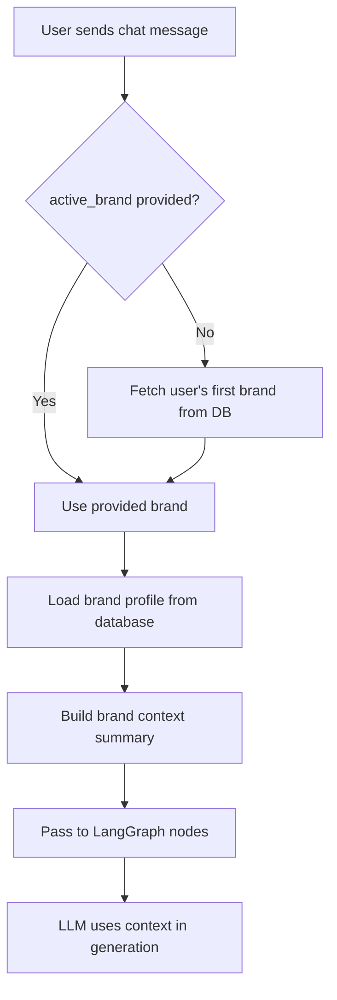

# Brand Context Loading Fix

## Problem
Brand context and business information were not being loaded into the LLM's memory during normal chat and A2A protocol execution.

## Root Causes

### 1. **Frontend-Backend Field Mismatch**
- **Frontend** (`frontend/app/page.tsx`): Sent `brand` field in chat request
- **Backend** (`orchestrator.py`): Expected `active_brand` field
- **Result**: Brand name was never received by the orchestrator

### 2. **No Automatic Brand Selection**
- If `active_brand` was not explicitly provided, the orchestrator would skip loading brand context entirely
- Users without an active brand selected would get responses without any business context

## Fixes Applied

### 1. Fixed Frontend Field Name
**File**: `frontend/app/page.tsx` (line 302)
```typescript
// BEFORE:
brand: localStorage.getItem("activeBrandName") || undefined,

// AFTER:
active_brand: localStorage.getItem("activeBrandName") || undefined,
```

### 2. Added Automatic Brand Selection in Chat Endpoint
**File**: `orchestrator.py` (lines 1251-1273)
```python
# If no brand specified, try to get user's first brand from DB
if not active_brand_name:
    try:
        user_brands = db.get_user_brands(user_id)
        if user_brands and len(user_brands) > 0:
            active_brand_name = user_brands[0].get("brand_name", "")
            logger.info(f"Chat: auto-selected brand '{active_brand_name}' for user {user_id}")
    except Exception as e:
        logger.warning(f"Could not fetch user brands for chat: {e}")
```

### 3. Added Automatic Brand Selection in A2A Protocol
**File**: `orchestrator.py` (lines 4136-4149)
```python
# If no brand specified in metadata, try to get user's first brand from DB
if not active_brand:
    try:
        user_brands = db.get_user_brands(user_id)
        if user_brands and len(user_brands) > 0:
            active_brand = user_brands[0].get("brand_name", "")
            logger.info(f"A2A task: auto-selected brand '{active_brand}' for user {user_id}")
    except Exception as e:
        logger.warning(f"Could not fetch user brands for A2A task: {e}")
```

## How Brand Context Flows Now



## What Brand Context Includes

The `_build_user_context_summary()` function builds a text summary containing:
- ✅ Business Name
- ✅ Website URL
- ✅ Industry
- ✅ Target Audience
- ✅ Location
- ✅ Unique Selling Points
- ✅ Product/Service Descriptions
- ✅ Brand Voice and Tone
- ✅ Visual Assets (logos, colors, fonts)

## Verification

### Test in Chat UI
1. Login to the frontend
2. Send a message: "Create an Instagram post for my business"
3. Check orchestrator logs for: `Chat: auto-selected brand 'YourBrandName' for user X`
4. Verify the response references your business details

### Test in Protocol Dashboard
1. Navigate to `/protocols`
2. Click "Test A2A"
3. Check logs for: `A2A task: auto-selected brand 'YourBrandName' for user X`
4. Verify the generated content uses your brand context

## Related Files
- `orchestrator.py` - Main chat endpoint and A2A handler
- `frontend/app/page.tsx` - Chat UI component
- `frontend/app/protocols/page.tsx` - Protocol testing dashboard
- `langgraph_graph.py` - LangGraph state management
- `langgraph_nodes.py` - Individual workflow nodes that consume brand context
- `database.py` - `get_user_brands()` and `get_brand_profile()` functions

