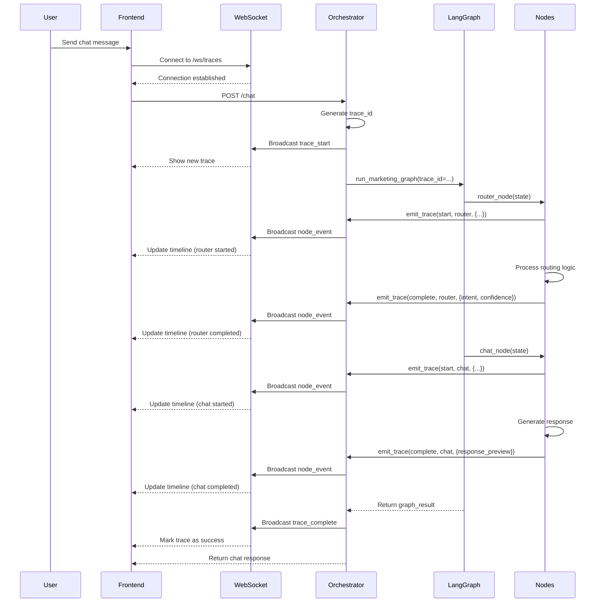

# Live Agent Execution Visualizer

## Overview
A real-time agent execution visualizer similar to **n8n** and **LangSmith** that shows live workflow execution, node transitions, inputs/outputs, and detailed traces without page reloads.

## Features

✅ **Real-time WebSocket Updates** - Live streaming of execution events  
✅ **Node-level Tracing** - Start, progress, complete, and error events for each node  
✅ **Timeline Visualization** - Visual flow diagram showing execution path  
✅ **Input/Output Inspection** - Detailed view of data flowing through nodes  
✅ **Error Tracking** - Immediate visibility into failures  
✅ **Trace History** - Browse recent executions  
✅ **Auto-reconnection** - Robust WebSocket connection management  

## Architecture

```
┌──────────────────────────────────────────────────────────────┐
│                   Frontend (Next.js)                         │
│                  /visualizer route                            │
│              WebSocket Client (ws://localhost:8004)          │
└────────────┬─────────────────────────────────────────────────┘
             │ WebSocket
             ▼
┌──────────────────────────────────────────────────────────────┐
│                Orchestrator (FastAPI)                        │
│   • WebSocket Endpoints: /ws/traces, /ws/traces/{id}        │
│   • REST Endpoints: GET /traces, GET /traces/{id}           │
│   • TraceManager: In-memory trace storage & broadcasting    │
└────────────┬─────────────────────────────────────────────────┘
             │ trace_id injection
             ▼
┌──────────────────────────────────────────────────────────────┐
│                LangGraph Workflow Engine                     │
│   • MarketingState includes trace_id                         │
│   • Each node emits trace events via emit_trace()            │
│   • Events: start, progress, complete, error                 │
└──────────────────────────────────────────────────────────────┘
```

## Implementation

### 1. Backend Components

#### `trace_manager.py`
- **TraceManager**: Singleton that manages traces and WebSocket connections
- **TraceEvent**: Individual execution events (start/progress/complete/error)
- In-memory storage of active traces
- WebSocket broadcasting to all connected clients

#### `orchestrator.py` Updates
- Added WebSocket imports and endpoints
- `/ws/traces` - Stream all traces
- `/ws/traces/{trace_id}` - Stream specific trace
- `GET /traces` - List recent traces (REST fallback)
- `GET /traces/{trace_id}` - Get trace details (REST fallback)
- Chat endpoint generates unique `trace_id` and passes to LangGraph

#### `langgraph_state.py` Updates
- Added `trace_id: Optional[str]` to `MarketingState`

#### `langgraph_nodes.py` Updates
- Added `emit_trace()` helper function
- Router node emits: start → complete/error
- Chat node emits: start → complete/error
- Can be extended to all nodes (blog, social, SEO, research, etc.)

### 2. Frontend Component

#### `/visualizer` Route (`frontend/app/visualizer/page.tsx`)
- **Left Panel**: List of recent traces with status indicators
- **Right Panel**: Detailed execution flow with timeline
- **Real-time Updates**: WebSocket connection for live events
- **Event Timeline**: Visual representation with color-coded status
- **Expandable Details**: Click to view full input/output JSON

### 3. Data Flow



## Usage

### 1. Start the Orchestrator
```bash
python3 orchestrator.py
```

### 2. Start the Frontend
```bash
cd frontend
npm run dev
```

### 3. Open the Visualizer
Navigate to: `http://localhost:3000/visualizer`

### 4. Trigger Executions
- Go to the main chat: `http://localhost:3000`
- Send messages to trigger workflow execution
- Watch live traces appear in the visualizer

### 5. Test A2A Protocol
- Go to: `http://localhost:3000/protocols`
- Click "Test A2A"
- View execution in the visualizer

## Trace Event Types

| Event Type | Color | Description |
|------------|-------|-------------|
| `start` | Blue | Node execution started |
| `progress` | Yellow | Intermediate progress update |
| `complete` | Green | Node completed successfully |
| `error` | Red | Node encountered an error |

## Adding Traces to New Nodes

To add tracing to any LangGraph node:

```python
async def your_node(state: MarketingState) -> Dict[str, Any]:
    # Emit start event
    emit_trace(state, "start", "your_node", {
        "input_param": state.get("some_input")
    })
    
    try:
        # Your node logic here
        result = await do_something()
        
        # Emit completion event
        emit_trace(state, "complete", "your_node", {
            "output": result,
            "metric": some_value
        })
        
        return {"result": result}
        
    except Exception as e:
        # Emit error event
        emit_trace(state, "error", "your_node", {
            "error": str(e)
        })
        raise
```

## WebSocket Message Format

### Initial Connection
```json
{
  "type": "initial_traces",
  "traces": [
    {
      "trace_id": "chat_session123_1775040123",
      "user_id": 1,
      "session_id": "session123",
      "user_message": "Create a blog about AI",
      "intent": "blog_generation",
      "workflow": "langgraph",
      "start_time": "2026-04-01T14:30:00.000Z",
      "status": "running"
    }
  ]
}
```

### Trace Start
```json
{
  "type": "trace_start",
  "trace_id": "chat_session123_1775040123",
  "metadata": { /* same as above */ }
}
```

### Node Event
```json
{
  "type": "node_event",
  "trace_id": "chat_session123_1775040123",
  "event_type": "complete",
  "node": "router",
  "timestamp": "2026-04-01T14:30:01.234Z",
  "data": {
    "intent": "blog_generation",
    "confidence": 0.95,
    "extracted_params": {"topic": "AI"}
  }
}
```

### Trace Complete
```json
{
  "type": "trace_complete",
  "trace_id": "chat_session123_1775040123",
  "metadata": {
    /* ... */
    "status": "success",
    "end_time": "2026-04-01T14:30:05.678Z",
    "duration_ms": 5444
  }
}
```

## Next Steps

### Extend to More Nodes
Currently only `router_node` and `chat_node` emit traces. Add tracing to:
- `blog_node`
- `social_post_node`
- `seo_node`
- `research_node`
- `campaign_node`
- `image_generation_node`

### Enhanced Visualization
- **Flow Diagram**: Use React Flow to show graph structure
- **Performance Metrics**: Node execution time, token usage
- **Cost Tracking**: LLM API costs per trace
- **Filtering**: Filter by intent, status, user
- **Search**: Full-text search in traces
- **Export**: Download trace data as JSON

### Persistence
- Store traces in SQLite database
- Historical analysis and replay
- Performance trends over time

## Troubleshooting

### WebSocket Not Connecting
- Ensure orchestrator is running on port 8004
- Check CORS settings in orchestrator.py
- Verify frontend is connecting to correct URL

### No Traces Appearing
- Check orchestrator logs for trace events
- Verify `trace_id` is being passed to `run_marketing_graph()`
- Ensure nodes are calling `emit_trace()`

### Events Not Updating in Real-time
- Check WebSocket connection status (green dot in UI)
- Look for errors in browser console
- Verify `TraceManager` is broadcasting events

## Related Files
- `trace_manager.py` - Trace storage and WebSocket management
- `orchestrator.py` - WebSocket endpoints and trace initialization
- `langgraph_state.py` - State definition with trace_id
- `langgraph_nodes.py` - Node instrumentation with emit_trace()
- `frontend/app/visualizer/page.tsx` - Visualization UI

